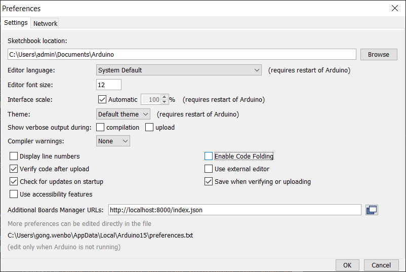
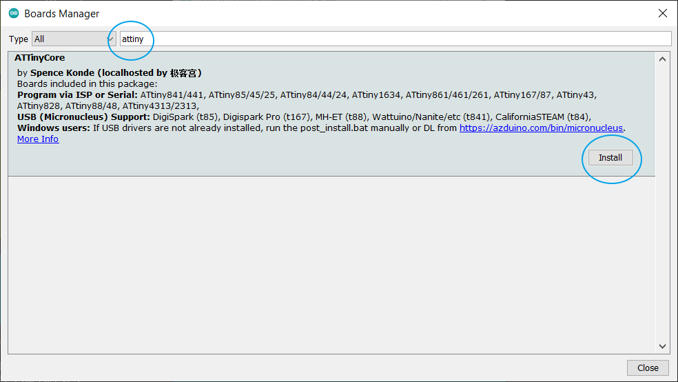

# attiny本地镜像站

>对 http://drazzy.com/package_drazzy.com_index.json 做了精简，只保留ATTiny部分。并把相应版本的压缩文件进行了下载。


## 下载http.zip

https://github.com/jikegong/attiny-local-for-arduino/releases

## 使用方法：

1、解压缩http.zip为http文件夹。在命令行进入http目录并启动本地服务器：

```python
python3 -m http.server
```

如果没有python3请去安装 https://www.python.org/downloads/

2、把下面的url粘贴到arduino属性的开发板管理器里。

file -> Preferences

Additional Boards Manager URLs:
```shell
http://localhost:8000/index.json
```



3、打开开发版管理器，搜索attiny，点击install进行安装




## arduino IDE下载地址

### windows

https://downloads.arduino.cc/arduino-1.8.16-windows.zip

### mac

https://downloads.arduino.cc/arduino-1.8.16-macosx.zip

### linux

https://downloads.arduino.cc/arduino-1.8.16-linux64.tar.xz

### arm

https://downloads.arduino.cc/arduino-1.8.16-linuxarm.tar.xz

https://downloads.arduino.cc/arduino-1.8.16-linuxaarch64.tar.xz


### 声明

所有文件来源于　http://drazzy.com/package_drazzy.com_index.json 中指向的原始文件，并未对文件进行安全验证。

本项目 http.zip 的 md5 为：
```
96486e5e84ca163251b3d91f4de2e694
```

验证方法：

windows :
```
certutil -hashfile .\http.zip MD5
```

linux：
```
md5sum .\http.zip
```

如果你验证的http.zip MD5 不是 96486e5e84ca163251b3d91f4de2e694 请勿使用。

即便 MD5 为 96486e5e84ca163251b3d91f4de2e694 也不能保证安全，因为相关文件是从 http://drazzy.com/package_drazzy.com_index.json 中的地址下载的，而http://drazzy.com/package_drazzy.com_index.json 并未经过安全验证。
